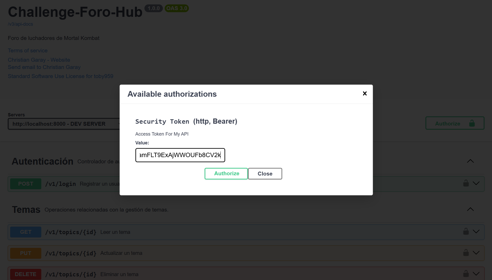

 <h1 style="text-align: center;"> Api Foro-Hub 👁️‍🗨️</h1>


# Descripción 📖
Este proyecto consiste en el desarrollo de una API REST para gestionar un grupo de pelea de la mítica saga Mortal Kombat. La API permite registrar información relevante sobre los temas de combate, incluyendo el título, mensaje, estado, autor y curso, utilizando MySQL Workbench como sistema de gestión de bases de datos.
Con esta API, los usuarios pueden interactuar con los datos relacionados con los temas de Mortal Kombat, facilitando así la creación y gestión de contenido dentro del universo del juego.
___

# Recursos 👾

| Plugin           | URL                      |
|------------------|--------------------------|
| spring-boot-starter-web | https://start.spring.io/ |
| spring-boot-devtools    | https://start.spring.io/ |
| lombok | https://start.spring.io/ |
| spring-boot-starter-data-jpa | https://start.spring.io/ |
| flyway-core | https://start.spring.io/ |
| flyway-mysql | https://start.spring.io/ |
| mysql-connector-j | https://start.spring.io/ |
|spring-boot-starter-hateoas | https://start.spring.io/ |
| spring-boot-starter-validation | https://start.spring.io/ |
| spring-boot-starter-security | https://start.spring.io/ |
| java-jwt | https://start.spring.io/ |
| springdoc-openapi-starter-webmvc-ui | https://springdoc.org/#getting-started |
___
# Herramientas utilizadas 🛠️


&nbsp;
&nbsp;
&nbsp;
&nbsp;
&nbsp;
&nbsp;

&nbsp;&nbsp;&nbsp;&nbsp;&nbsp;&nbsp;&nbsp;&nbsp;&nbsp;[](LICENSE)&nbsp;&nbsp;&nbsp;&nbsp;&nbsp;&nbsp;&nbsp;&nbsp;&nbsp;
___


# Ejecutar el Proyecto ⚙️
1 - Clona el repositorio en tu máquina local
``` bash
git clone
<https://github.com/toby959/challenge_foro_hub.git>
```
2 - Compila y ejecuta el archivo ChallengeForoHubApplication.java
___

# Funcionalidades 📦
Además, se emplea Flyway, una herramienta de migración de bases de datos que facilita la gestión de cambios en la estructura de la base de datos a lo largo del tiempo.
### Beneficios
Simplicidad: Facilita el manejo de migraciones sin necesidad de realizar cambios manuales en la base de datos.
Trazabilidad: Ofrece un registro claro y accesible sobre el estado actual y el historial de las migraciones aplicadas.
Integración: Se integra fácilmente con herramientas como Maven y Gradle, así como con frameworks como Spring Boot.
___
## Uso de Postman
* Base de datos: `challenge-foro`
#### Flexibilidad: Al usar una variable como {{url}}, puedes cambiar la URL base en un solo lugar (en la configuración del entorno) y todas las solicitudes que utilicen esa variable se actualizarán automáticamente. Esto es especialmente útil cuando trabajas con diferentes entornos (desarrollo, pruebas, producción) donde la URL puede variar.

## Métodos:

### POST
- **Descripción**: Este método se utiliza para iniciar sesión en la API con las credenciales almacenadas en la base de datos. La contraseña se codifica utilizando BCrypt antes de ser almacenada en la base de datos, lo que proporciona una capa adicional de seguridad.
- **Endpoint**: `{{url}}/v1/login`
- **Cuerpo de la solicitud**:

````bash
{
        "login": "ahoraveo@gmail.com",
        "password": "1234"
}
````


### POST
- **Descripción**: Este método se utiliza para crear un nuevo **tema** en la base de datos.
- **Endpoint**: `{{url}}/v1/topics`
- **Cuerpo de la solicitud**:

````bash
{
       "title": "Mortal Kombat XI",
       "message": "I will leave these sands with your blood!!!",
       "status": "ACTIVE",
       "author": "MILEENA",
       "course": "BRUTALITY"
}
````
### GET
- **Descripción**: Este método trae una lista de **temas**, según el uso de 'Page' usado para la paginación de los datos de DB, en este caso `@PageableDefault(size = 5)`.
- **Endpoint**: `{{url}}/v1/topics`
- **Cuerpo de la solicitud**: vacío.

### PUT
- **Descripción**: Este método permite modificar, titulo; mensaje; status; autor; curso.
- **Endpoint**: `{{url}}/v1/topics/5`
- **Cuerpo de la solicitud**:
````bash
{
    "title": "Mortal Kombat IX",
    "message": "You Wanted was to fix my life!!!",
    "status": "PENDING",
    "author": "JAX",
    "course": "FATALITY"
}
````

### DEL
- **Descripción**: Este método permite el borrado de un **tema**.
- **Endpoint**: `{{url}}/v1/topics/3`
- **Cuerpo de la solicitud**: vacío.

### GET
- **Descripción**: Este método trae un **tema**, con los siguientes valores:
````bash
{
    "title": "Mortal Kombat X",
    "message": "Or I'll Soak These Sands With Your Blood!",
    "creationDate": "2024-11-27T22:18:07",
    "status": "ACTIVE",
    "author": "SUB-ZERO",
    "course": "BRUTALITY"
}
````
- **Endpoint**: `{{url}}/v1/topics/3`
- **Cuerpo de la solicitud**: vacío.

___

# Colaboraciones 🎯
Si deseas contribuir a este proyecto, por favor sigue estos pasos:

1 - Haz un fork del repositorio: Crea una copia del repositorio en tu cuenta de GitHub.
2 - Crea una nueva rama: Utiliza el siguiente comando para crear y cambiar a una nueva rama:
```bash
git chechout -b feature-nueva
```
3 - Realiza tus cambios: Implementa las mejoras o funcionalidades que deseas agregar.
4 - Haz un commit de tus cambios: Guarda tus cambios con un mensaje descriptivo:
```bash
git commit -m 'Añadir nueva funcionalidad'
```
5 - Envía tus cambios: Sube tu rama al repositorio remoto:
````bash
git push origin feature-nueva
````
6 - Abre un pull request: Dirígete a la página del repositorio original y crea un pull request para que revisemos tus cambios.

💥Gracias por tu interés en contribuir a este proyecto. ¡Esperamos tus aportes!
___
# Imagenes:


___
## Swagger

````
localhost:8000/swagger-ui.html
````

### Instrucciones para Autenticación

1. **Genera la Clave**: Utiliza el script proporcionado a continuación para generar la clave.
````
{
  "login": "ahoraveo@gmail.com",
  "password": "1234"
}
````




2. **Copia el Token**: Una vez que hayas generado la clave, copia el token resultante.
3. **Autoriza el Acceso**:
    - Haz clic en el botón **'Authorize'** en la interfaz de Swagger.
    - Pega el token copiado en el campo correspondiente.
    - Presiona nuevamente el botón **'Authorize'** para confirmar.
    - Finalmente, haz clic en el botón **'Close'** para cerrar la ventana de autorización.

Con estos pasos, podrás acceder a todos los endpoints de la API.


___

#### * Swagger: Leer la documentacion [Visita Swagger](https://springdoc.org/)
___

## Licencia 📜

#### Este proyecto está licenciado bajo la Licencia MIT - ver el archivo [LICENSE](https://github.com/toby959/foro-hub/blob/main/LICENSE) para más detalles.


